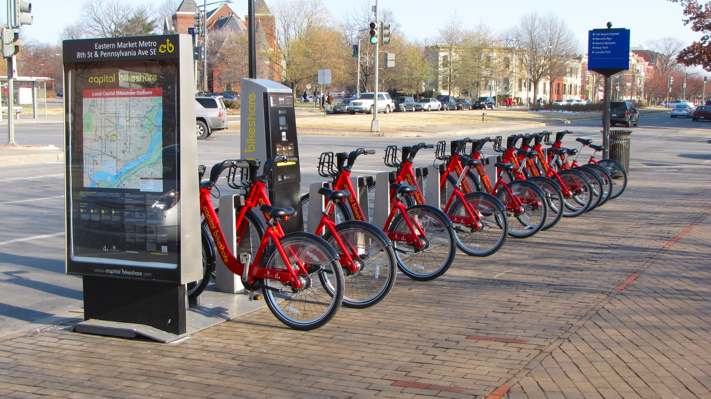
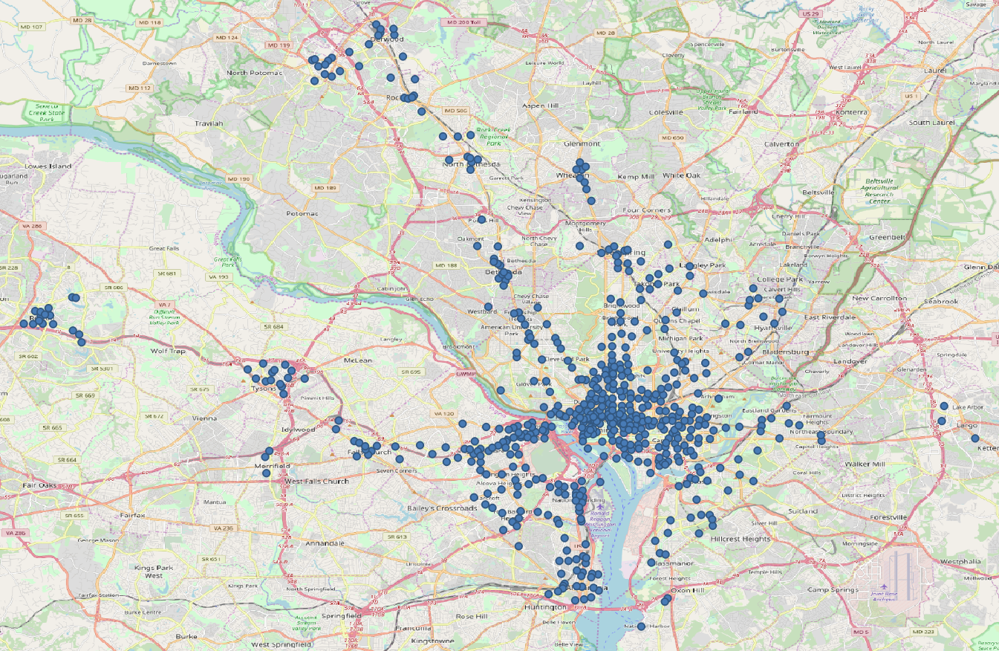

```{r setup, include=FALSE}
knitr::opts_chunk$set(
	echo = FALSE,
	message = FALSE,
	warning = FALSE
)
```

```{r basicfcn, include=F}
# can add quietly=T option to the require() function
loadPkg = function(x) { if (!require(x,character.only=T, quietly =T)) { install.packages(x,dep=T,repos="http://cran.us.r-project.org"); if(!require(x,character.only=T)) stop("Package not found") } }
```

```{r}
# packages used
loadPkg("dplyr")
loadPkg("lubridate") # for extracting hour, day of week, month, year from date of type character
loadPkg("ggplot2")
loadPkg("tibble")
loadPkg("tidyr")
loadPkg("scales")
loadPkg("corrplot")
loadPkg("randomForest")
loadPkg("caret") # for random forest, decision tree, bagged decision tree
loadPkg("rpart.plot") # to plot decision tree
loadPkg("relaimpo") # to find contribution of each variable towards r-squared 
loadPkg("leaps")
loadPkg("tidyverse")
loadPkg("car")
loadPkg("readr")
loadPkg("plyr")
loadPkg("psych")
loadPkg("kableExtra")
```


## Chapter 1: Introduction



Capital Bikeshare (also called CapBi) is a bicycle sharing system that serves Washington DC, Arlington County, Alexandria, Falls Church, Montgomery County, Prince George's County, and Fairfax County. The Capital Bikeshare system is owned by the local governments and is operated by Motivate International, Inc.(Motivate International, Inc). As of August 2019, Capital Bike has 500 stations and 4300 bicycles.

The distribution of the docks is shown below:


As we can see from the above image, the majority of the docks for the bicycle are in Washington DC. 

Bike tours in Washington DC are not only a popular family activity but renting a bike is a great way to get around without breaking the bank or sitting in traffic. There are dedicated bike lanes in Washington DC hence there is safety and convenience for the rider. 

Capital BikeShare is undoubtedly **cheaper** than its competitors and the docks are conveniently placed around monumental locations. Capital Bikeshare is often faster than other modes of transportation and its annual membership offers unlimited trips under 30 minutes which helps save money. CapBi can be used to commute to work or ride to meet friends and is a great alternative for exercise since it is human-powered instead of electric powered. CapBi services save fuel, prevents carbon emissions, it is not only healthy for the rider but also for the environment. 

As CapBi services are very popular and always in demand, we want to predict the number of bikes riders will use per hour and have contingencies to fulfill the demand. To estimate the number of bikes required we will consider various factors such as weather, temperature, working or non-working hour, the hour of the day, etc.

Fun Fact: CapBi offers GWU students annual membership for only 25$.("Capital Bikeshare Discount")

## Chapter 2: Description of Data

### 2.1 Source of data

The data is sourced from the official Capital Bikeshare website, https://www.capitalbikeshare.com/system-data. We have downloaded data for **September 2013 to September 2019**.

The **official data** contains only the following variables:

Variable | Description
---------|-------------
Duration | Duration of trip
Start Date | Includes start date and time
End Date | Includes end date and time
Start Station | Includes starting station name and number
End Station | Includes ending station name and number
Bike Number | Includes ID number of bike used for the trip
Member Type |Indicates whether user was a "registered" member (Annual Member, 30-Day Member or Day Key Member) or a "casual" rider (Single Trip, 24-Hour Pass, 3-Day Pass or 5-Day Pass)

We dropped irrelevant columns like Duration, End Date, End Station, Bike Number and Member Type from official capital bike share dataset. 

To predict the number of bikes to be used hourly we *scraped the weather data* from following website: https://www.wunderground.com/history/daily/us/va/arlington-county/KDCA/.

To also understand whether *holiday* influences the increase or decrease in bike usage we downloaded the holiday dataset from https://www.kaggle.com/gsnehaa21/federal-holidays-usa-19662020.

```{r}
bike_captial_df <- read.csv("./rawF_CapitalBikeShare.csv")
```

We merged all the different data sources into a single file for our analysis.

### 2.2 Preprocessing of Data

Once the merging of data is done we will preprocess our data. We dropped irrelevant columns like Start.station, Wind, Wind.Gust..mph., Pressure..in., Precip...in. as they are not useful for our analysis. 

```{r}
# Dropping irrelevant columns
bike_captial_df <- subset(bike_captial_df, select = -c(Start.station,Wind,Wind.Gust..mph.,Pressure..in.,Precip...in.))
```

We condensed the Condition column which has 47 levels into 6 levels. If condition is Cloudy,Cloudy / Windy,Mostly Cloudy,Mostly Cloudy / Windy,Partly Cloudy,Partly Cloudy / Windy we replace it by Cloudy itself. 

```{r}
# Condensing "Condition" variable to 6 levels from 47 levels.

# Removing empty string
bike_captial_df <- subset(bike_captial_df, Condition != "")

# converting from factor to character
bike_captial_df$Condition <- as.character(bike_captial_df$Condition)

# condensing for cloudy
bike_captial_df$Condition[bike_captial_df$Condition %in% c("Cloudy","Cloudy / Windy","Mostly Cloudy","Mostly Cloudy / Windy","Partly Cloudy","Partly Cloudy / Windy")] <- "Cloudy"

# condensing for Windy
bike_captial_df$Condition[bike_captial_df$Condition %in% c("Squalls / Windy","Thunder","Thunder / Windy","Thunder in the Vicinity","Wintry Mix","Wintry Mix / Windy")] <- "Windy"

# condensing for Fair
bike_captial_df$Condition[bike_captial_df$Condition %in% c("Fair","Fair / Windy")] <- "Fair"

# condensing for Fog
bike_captial_df$Condition[bike_captial_df$Condition %in% c("Fog","Mist","Patches of Fog","Shallow Fog","Haze")] <- "Fog"

# condensing for Rain
bike_captial_df$Condition[bike_captial_df$Condition %in% c("Heavy Rain","Heavy Rain / Windy","Light Rain","Light Rain / Windy","Light Rain with Thunder","Rain","Rain / Windy","Light Drizzle","Light Drizzle / Windy","Heavy T-Storm","Heavy T-Storm / Windy","T-Storm","T-Storm / Windy")]<-"Rain"

# condensing for Snow
bike_captial_df$Condition[bike_captial_df$Condition %in% c("Heavy Snow","Light Freezing Drizzle","Light Sleet","Light Sleet / Windy","Light Snow","Light Snow / Windy","Light Snow and Sleet","Light Snow and Sleet / Windy","Rain and Sleet","Rain and Snow","Sleet","Snow","Snow and Sleet","Light Freezing Rain")]<-"Snow"
```

Similar logic is used of other weather conditions as well. We finally have the following levels in Condition column:
```{r}
sort(unique(bike_captial_df$Condition))  %>% kable(col.names = c("Condition")) %>% kable_styling()
```

The Holiday column has the following values:
```{r}
unique(bike_captial_df$Holiday)  %>% kable(col.names = c("Holiday")) %>% kable_styling()
```

We convert the Holiday column from factors into a **binary column** where 0 means no Holiday and 1 means Holiday.

```{r}
# convert Holiday column to binary variable
bike_captial_df <- mutate(bike_captial_df, Holiday = ifelse(is.na(Holiday),0,1))
```

Since our dataset has information about the number of bikes used per hour across various stations, we want to simplify this, thus we aggregate all the CapBi data on an hourly basis.

```{r}
# aggregate data on hourly basis and left join with original dataset, then keep only distinct rows and sort by start date
bike_captial <- (bike_captial_df %>% dplyr::group_by(Start.date) %>% dplyr::summarise(Total_Bikes = sum(noOfBikes))) %>% left_join( subset(bike_captial_df, select=-noOfBikes), by = "Start.date") %>% distinct(Start.date,.keep_all = TRUE) %>% arrange(Start.date)
```

We also rename the columns for ease of use. 

We use the **lubridate** package to extract the hour, month, day and year from the Start_Date column which is of type character. For example 2019-09-20 18:00:00 is the date and thus the hour is 18, month is 09, day is 20 and year is 2019.
```{r}
# renaming the columns
colnames(bike_captial) <- c("Start_Date","Total_Bikes","Condition","Temp","Dew","Humidity","Windspeed","Holiday","Weekday","TimeofDay","Season")

# using lubridate to etract hour, month, day, bike
bike_captial$HourOfDay <- hour(bike_captial$Start_Date)
bike_captial$Month <- month(bike_captial$Start_Date)
bike_captial$Day <- day(bike_captial$Start_Date)
bike_captial$Year <- year(bike_captial$Start_Date)
```

```{r}
# repositioning the Y-variable i.e. the Total_Bikes and placing it at the end 
bike_captial <- bike_captial[c(1,3:15,2)]
```

We convert the following columns to factors HourOfDay, Month, Year, Day, Condition, Holiday, Weekday, TimeofDay, Season.
```{r}
# converting all categorical variables to factors
bike_captial$HourOfDay <- as.factor(bike_captial$HourOfDay)
bike_captial$Month <- as.factor(bike_captial$Month)
bike_captial$Year <- as.factor(bike_captial$Year)
bike_captial$Day <- as.factor(bike_captial$Day)
bike_captial$Condition <- as.factor(bike_captial$Condition)
bike_captial$Holiday <- as.factor(bike_captial$Holiday)
bike_captial$Weekday <- as.factor(bike_captial$Weekday)
bike_captial$TimeofDay <- as.factor(bike_captial$TimeofDay)
bike_captial$Season <- as.factor(bike_captial$Season)
```

The first 6 rows of the final processed dataset are:
```{r}
head(bike_captial) %>% kableExtra::kable() %>% kableExtra::kable_styling()
```


## Chapter 4: Exploratory Data Analysis

### 4.1 SMART Question:

In this analysis, the question that we want to answer or predict is -

#### What is the total number of bikes rented at a given hour based on temperature and season?

Exploratory Data Analysis is performed to understand the underlying patterns before moving to model creation. This helps us understand what to expect from the models.

```{r}
# dataframe for eda purposes
capbs <- bike_captial

#remove year 2013 and 2019
capbs <- bike_captial[bike_captial$Year != "2013" & bike_captial$Year != "2019",]

# convert hour factor to continuous values
capbs$HourOfDay <- as.integer(as.character(capbs$HourOfDay))
```

### 4.2 Bike Demand by Season and Temperature

From the plots below we can see that winter is the least favorite season for hiring bikes while spring, summer, and fall have pretty similar patterns, which is justified because roads covered with snow are difficult to cycle in, so the demand for bikes reduces during the winter season.

```{r}
# to have consistent theme for all plots
theme_set(theme_minimal())
```

```{r}
ggplot()+ geom_jitter(aes(Season,Total_Bikes,color=Season),alpha =0.5, data=capbs, show.legend = FALSE) + labs(title = "Distribution of Bikes per Season")+xlab("Season")+ylab("Number of Bikes")
```

In this plot, we also include the temperature and observe that higher numbers of bikes are rented as temperature increases, and the optimum temperature is between 80-90 degrees Fahrenheit.

```{r}
ggplot(capbs, aes(x = Temp,  y = Total_Bikes)) + geom_point(aes(color = Season,alpha =0.1), show.legend = FALSE) + facet_grid(rows =vars(Season)) + geom_smooth() + scale_y_continuous(limits = c(0,2000), breaks=seq(0,2000,500)) + scale_x_continuous(limits = c(0,120), breaks=seq(0,120,15)) + xlab("Temperature")+ ylab("Number of bikes") + labs(title = "Distribution of Bikes based on Season and Temperature") 
```


### 4.3 Bike Demand by Weather Conditions

The plot shows that people like to bike most in cloudy weather, followed by fair. Rain, snow, windy etc. are not preferred.

```{r}
ggplot() + geom_jitter(aes(Condition,Total_Bikes,color = Condition),alpha=0.5, data=capbs, show.legend = FALSE) + labs(title = "Distribution of Bike by Weather Condition") + ylab("Number of Bikes") + xlab("Weather Condition")
```


### 4.4 Bike Demand by Year, Weekday & Hour of the Day

There is a steady increase in the number of bikes rented up to the year 2017 and then it decreased in 2018. There is a slight difference between bikes rented between weekdays and weekends, with more bikes rented during weekdays because that is when people commute to work.

```{r}
# aggregating based on weekday and year
bikeShareWeekDay <- capbs %>%
        dplyr::group_by(Year, Weekday) %>%
        dplyr::summarise(Total_Bikes = sum(Total_Bikes, na.rm = TRUE))

# 52 * 5 = 260 Weekdays, divide to normalize values
bikeShareWeekDay[bikeShareWeekDay$Weekday == "Weekday","Total_Bikes"] <- round(bikeShareWeekDay[bikeShareWeekDay$Weekday == "Weekday","Total_Bikes"]/260)

# 52 * 2 = 104 Weekends, divide to normalize values
bikeShareWeekDay[bikeShareWeekDay$Weekday == "Weekend","Total_Bikes"] <- round(bikeShareWeekDay[bikeShareWeekDay$Weekday == "Weekend","Total_Bikes"]/104)
  
ggplot(bikeShareWeekDay, aes(factor(Year), Total_Bikes, fill = factor(Weekday))) + geom_bar(stat = "identity", position = "dodge") + labs(title = "Bikes rented by Year/Weekday",fill = "Day of Week") + scale_y_continuous(labels= comma) + xlab("Year") + ylab("Number of Bikes")
```

The bikes hired peak during morning and evening 8 AM and 6 PM rush hours when people are heading to or returning back from work.

```{r}
ggplot(capbs, aes(x=HourOfDay, y=Total_Bikes, color = HourOfDay)) + geom_bar(stat="identity", show.legend = FALSE) + scale_x_continuous(breaks=seq(0,24,2)) + labs(title = "Distribution of Bikes per hour") + xlab("Hour of Day") + ylab("Number of bikes")
```

### 4.5 Bike Demand by Holiday

We notice that riders rent bikes more often on days when there is no holiday, but the number of bikes rented during holidays is still significant. This could be because people like to commute within DC on a bike and do sightseeing on holidays.

```{r}
holidayBike <- capbs %>% group_by(Holiday) %>% dplyr::summarise("Total Bikes" = sum(Total_Bikes), "Count of Holiday" = n())

# normalize the bike demand, by dividing by Count of Holiday and non holidays
holidayBike$NormalizedCount <- holidayBike$`Total Bikes`/holidayBike$`Count of Holiday`
```

```{r}
ggplot(data = holidayBike) + ggplot2::geom_bar(aes(x=Holiday,y=NormalizedCount,fill = c("green","red")),stat = "identity", show.legend = FALSE) + labs(title = "Normalized Bike Distribution for Holiday") + xlab("Holiday") + ylab("Number of Bikes") + scale_x_discrete(labels=c("Normal Day","Holiday"))
```


### 4.6 Correlation Between Bikes Hired and Weather 

There is a positive 44% correlation between temperature and bikes hired, additionally, Humidity has a negative correlation of 30%. 

The correlation table for numerical variables like Temperature, Dew, Humidity, WindSpeed, and HourOfDay with respect to Total Bikes is as follows:
```{r}
newdata <- capbs[c(15,3:6,11)]
newdata1 = round(cor(newdata),2) 
newdata1 %>% kable() %>% kable_styling()
```

The pictorial representation of the above table is as follows:
```{r}
cex.before <- par("cex")
par(cex = 0.7)
corrplot(newdata1,tl.col="black",addCoef.col="black",tl.cex = 1/par("cex"),cl.cex = 1/par("cex"), addCoefasPercent =TRUE,col=colorRampPalette(c("#9370DB","#E6E6FA","#9400D3"))(10))
```

## Chapter 5: Model Assessment

### 5.1 Splitting into Train and Test Data

For our analysis we *scale all the numeric variables* like Temperature, Dew, Humidity and WindSpeed to avoid skewed results.

```{r}
# scaling only the numeric columns like Temp,Dew, Humidity, Windspeed
bike_captial[c("Temp","Dew","Humidity","Windspeed")] <- lapply(bike_captial[c("Temp","Dew","Humidity","Windspeed")], function(x) c(scale(x)))
```

We now split our dataset into Train and Test splits. For the years 2013, 2014, 2015, 2016, 2017 and 2018 we are considering these samples for **training** our model and using the sample for the year 2019 we will validate the performance of the model.

```{r}
Training_Set <- subset(bike_captial, Year %in% c(2013,2014,2015,2016,2017,2018))
Test_Set <- subset(bike_captial, Year %in% c(2019))
```

In our training set we have total **`r nrow(Training_Set)`** samples and for testing our model we have total **`r nrow(Test_Set)`** samples. 

We also drop irrelevant columns like Start_Date, Month, Day and Year in our training and test set, as these are not useful when creating models.
```{r}
# drop irrelevant columns in Training Set
Training_Set <- subset(Training_Set, select = -c(Start_Date,Month,Day,Year))
```

```{r}
# rename the outcome variable as y
names(Training_Set)[11] <- "y"
```

```{r}
# drop irrelevant columns in Test Set
Test_Set <- subset(Test_Set, select = -c(Start_Date,Month,Day,Year))
```

As we need to predict the number of bikes which is a **numerical value, we have to perform regression** analysis. We will create models using Linear Regression and then try to optimize it. We will use Decision Tree for regression and also try Bagged Decision Trees. Finally we will create a random forest model and try to tune it to get best results.


### 5.2 Linear Regression Model

We perform linear regression, using training data set and all the variables, we predict the number of bikes per hour which is our 'y' variable.

```{r}
fit1 <- lm(y~.,data = Training_Set)
```

```{r}
sumLm <- summary(fit1)
```

We notice that the R-squared value for linear model with all the variables is **`r sprintf(sumLm$r.squared,fmt = "%#.3f")`**.

We want to know how much of each variable contributes to the Linear model R-squared value i.e we want to know the relative importance of each variable in Linear model. For this we make use of the **relaimpo** package, and use the function calc.relimp.
```{r}
relativeImpFullLM <- calc.relimp(fit1, type = c("lmg"), rela = TRUE)
```

```{r}
sort(relativeImpFullLM$lmg,decreasing = TRUE) %>% kable(col.names = c("LMG")) %>% kable_styling()
```

The relative importance matrix show us that hour of the day heavily influences the model. It contributes to more that fifty percentage of variation in our model. Similarly, temperature, time of the day, dew, humidity are other factors which impact variation in the model.

#### 5.2.1 Feature selection on Linear Regression model

We have already evaluated the performance of the linear model using all predictor variables, we now perform feature selection so that we can create a linear model with a subset of the variables without compromising on the accuracy.

The output for **forward feature** selection is as follows:
```{r}
lmbest.fwd = regsubsets(y~.,data = Training_Set,nvmax = 10, nbest =1,method = "forward")
plot(lmbest.fwd,scale="adjr2",main="Adjusted R^2")
plot(lmbest.fwd,scale="bic",main="BIC")
plot(lmbest.fwd,scale="Cp",main="Cp")
```

We observe that adjusted r2 is maxixum when variables like Temp, TimeofDay, HourofDay are included. Similary BIC and Cp value are minimum when these same variables are in included in the model. 

Hence, forward feature selection suggests that including features such as Temp, TimeofDay, HourofDay increases the accuracy of the prediction.


The output for **backward feature** selection is as follows:
```{r}
lmbest.bwd = regsubsets(y~.,data = Training_Set,nvmax = 10, nbest =1,method = "backward")
plot(lmbest.bwd,scale="adjr2",main="Adjusted R^2")
plot(lmbest.bwd,scale="bic",main="BIC")
plot(lmbest.bwd,scale="Cp",main="Cp")
```

Similarly, we observe that adjusted r2 is maximum when variables like Temp, Humidity, HourofDay are included. BIC and Cp value is minimum when these same variables are included in the model. 

Hence, backward feature selection suggests that including features such as Temp, Humidity, HourofDay increases the accuracy of the prediction.

Overall, from the results of forward/backward features selection, we can conclude that variables like Temp, Humidity, TimeofDay, HourOfDay are important.

### 5.3 Optimize the Multiple Linear Regression Model

After removing nonessential features described in the previous section, we compute the linear model with four selected variables Temp, Dew, time of day, HourOfDay.

Moreover, we would like to examine the model further to find out which variables have the most impact on our outcome variable, the number of bikes.

```{r reducedmodel1, echo = FALSE, include= TRUE}
#feature selection with reduced model
reducedmodel_4 <- lm(y ~ Temp + Dew + TimeofDay + HourOfDay, data = Training_Set)

#display the summary of the reduced model 
summaryreducedmodel_4 <- summary(reducedmodel_4) 
``` 

We notice that the R-squared value for linear model with Temp, Dew, time of day, HourOfDay as the variables is **`r sprintf(summaryreducedmodel_4$r.squared,fmt = "%#.3f")`**.

From the results of the reduced linear model, we also observe that the Timeofday variable has high p-value and thus is not significant, so we exclude it and create a new linear model using the combination of three predictors which are Temp, Dew, HourOfDay.

```{r reducedmodel2, echo = FALSE, include= TRUE}
#exclude the timeofday since it has a high p value
reducedmodel_3 <- lm(y ~ Temp + Dew + HourOfDay, data = Training_Set)

#display the summary of the reduced-2 model 
summaryreducedmodel_3 <- summary(reducedmodel_3) 
``` 

The R-squared value for linear model with Temp, Dew, HourOfDay as the variables is still **`r sprintf(summaryreducedmodel_3$r.squared,fmt = "%#.3f")`**, but all the variables are significant since the p-values are below significant level.

An accurate multilinear model should not include two predictors that correlate with each other, as the relationship will affect the overall performance. 

Thus we proceed to the next step for examining and removing these potential relationships in our model. 

```{r vif, echo = FALSE, include= TRUE}
#multicollinearity
vif(reducedmodel_3)[,"GVIF"] %>% kable(col.names = "GVIF") %>% kable_styling()
``` 

As the result indicates, Temp and Dew point have a close relationship since they both had higher VIF values than HourOfDay. Since the Temp and Dew Point served the same purpose in our model, we would like to keep anyone that is most relevant to the outcome.

To identify the essential predictor, we build two new models which consist of Temp and Dew Point, respectively. 

* Model 1: y = Temp + HourOfDay
```{r reducedmodel3, echo = FALSE, include= TRUE}
#exclude the dew since it has high vif 
reducedmodel_2 <- lm(y ~ Temp + HourOfDay, data = Training_Set)
summaryreducedmodel_2 <- summary(reducedmodel_2) 
```

* Model 2: y = Dew + HourOfDay
```{r reducedmodel4, echo = FALSE, include= TRUE}
#exclude the temp since it has high vif 
reducedmodel_1 <- lm(y ~ Dew + HourOfDay, data = Training_Set)
summaryreducedmodel_1 <- summary(reducedmodel_1) 
``` 

The results of Temp(Model 1) is significantly better than the Dew(Model 2) in several key aspects, especially in R^2^. The R^2^ value for Model 1 is `r sprintf(summaryreducedmodel_2$r.squared,fmt = "%#.3f")` and the R^2^ value for Model 2 is `r sprintf(summaryreducedmodel_1$r.squared,fmt = "%#.3f")`.

The higher the R^2^ value is, the stronger is the relationship between the model and the outcome. Furthermore, higher R^2^ value also indicates that Temp is deemed more important to predict the number of bikes than Dew Point. 

Therefore, the final model consists of Temp and HourOfDay. 

#### 5.3.1 Relative importance

With the final model containing Temp and HourOfDay variables, we calculate what percentage does each predictor contributes to the model. 

```{r ri1, echo = FALSE, include= TRUE}
#find out the which feature contributed to the y the most
bike <- calc.relimp(reducedmodel_2, type = c("lmg"), rela = TRUE)
``` 

```{r ri2, echo = FALSE, include= TRUE }
#run the lmg metrics
bike$lmg %>% kable(col.names = "LMG") %>% kable_styling()
```

In 66% of the final model variance, the predictor HourOfDay contributes well over 70% and less than 30% of the contribution is from Temp, as shown in the bar chart below.

```{r ri3, echo = FALSE, include= TRUE}
#plot the lmg result
barplot(bike$lmg, main = "Contribution Percentages", xlab = "Variables", ylab = "Relative Importance", col = c("palegreen", "royalblue1"))
```


In this section, it has been explained using multiple linear regression HourOfDay and Temp are the most relevant predictor for predicting the number of bikes. The section that follows moves on to using the decision tree. 

### 5.4 Decision Tree

After performing Regression using linear model, we now perform regression using Decision Trees. Decision Trees have the advantage that they are simple to create and can work with non-linear data.

To save computational time we have stored the Decision Tree model as RDS file, and read the RDS file for our predictions.
```{r}
# save decision tree as rds model 

# set.seed(100)
# decisionTree <- caret::train(y~., data=Training_Set, method="rpart2", tuneLength = 9, trControl = trainControl(method = "repeatedcv",number = 10, repeats = 3))
# saveRDS(decisionTree,"Saved Models/tunedDecisionTree.rds")

#read the saved RDS file
decisionTree <- readRDS("Saved Models/tunedDecisionTree.rds")
```

We have created a decision tree using **Caret** package. The "rpart2" method of caret's train model creates a decision tree by tuning based on the depth of the decision tree. We have specified the max depth to be 10, by using the argument **tuneLength = 9**. We have also performed 10-Fold cross validation and repeated this 3 times.

The final depth used for creating decision tree is 10, and the plot for RMSE values with respect to max depth of decision tree is as follows:

```{r}
plot(decisionTree,main = "Tuning Regression Decision Tree based on Max Tree Depth")
```

As the depth of tree increases the performance increases i.e. the RMSE value of model decreases and it is minimum at depth = 10.

The Decision Tree which we will use for prediction is as follows::
```{r}
rpart.plot(decisionTree$finalModel, type = 5, box.palette = "Or", shadow.col = "gray", main = "Regression Decision Tree for predicting the number of bikes")
```

At the root node we have TimeOfDay as variable with value being Working Hour, the variable Temp occurs 3 times in the decision tree. The variable HourOfDay with value 18 occurs twice in the decision tree. The more occurrences of a variable, the more important it is. 


The importance of the variables for decision tree is shown below:
```{r}
gbmImp <- caret::varImp(decisionTree)
plot(gbmImp,top = 20)
```

We notice that the variables Temp, WeekdayWeekend, Dew, SeasonWinter and HourOfDay18 have high variable importance. The importance of variable depends on how high it shows up in the decision tree and also depends on number of times that variable repeats.(Therneau, 2019, p. 11)

We have trained our Decision Tree for 2013, 2014, 2015, 2016, 2017 and 2018 dataset. We now perform predictions based on 2019 dataset.

```{r}
dtTunedPredictions <- predict(decisionTree,Test_Set)
```

The evaluation metrics of Decision Tree is as follows:

```{r}
data.frame(
  R2 = caret::R2(dtTunedPredictions,Test_Set$Total_Bikes),
  RMSE = caret::RMSE(dtTunedPredictions,Test_Set$Total_Bikes),
  MAE = caret::MAE(dtTunedPredictions,Test_Set$Total_Bikes)
) %>% kable() %>% kable_styling()
```

#### 5.4.1 Bagged Decision Tree

Decision Trees have a drawback, they are not flexible and perform poorly with a new sample of data. Thus we use Bagging which is a combination of Bootstrapping the Data and performing Aggregation.

Bagged Decision Trees creates an ensemble of decision trees. Bagged Decision Trees overcome the drawback of Decision Trees by estimating the value based on majority or averages.

To save computational time we have stored the Bagged Decision Tree model as RDS file, and read the RDS file for our predictions.

```{r}
# baggedTree <- caret::train(y~.,Training_Set,method="treebag",trControl = trainControl(method = "repeatedcv", repeats = 3, number = 10))
# saveRDS(baggedTree,"Saved Models/baggedTree.rds")
baggedTree <- readRDS("Saved Models/baggedTree.rds")
```

We have created a bagged decision tree using **Caret** package. The "treebag" method of caret's train model creates a bagged decision tree. For bagged Decision tree there is no tuning parameter. We have performed 10-Fold cross validation and repeated this 3 times.

The importance of the variables for decision tree is shown below:

```{r}
baggedTreeImp <- varImp(baggedTree)
plot(baggedTreeImp,top = 20)
```

We notice that the variables Temp, WeekdayWeekend, Dew, HourOfDay18 and SeasonWinter have high variable importance.

We have trained our Decision Tree for 2013, 2014, 2015, 2016, 2017 and 2018 dataset. We now perform predictions based on 2019 dataset.

```{r}
baggedDtTunedPredictions <- predict(baggedTree,Test_Set)
```

The evaluation metrics of Decision Tree is as follows:

```{r}
data.frame(
  R2 = R2(baggedDtTunedPredictions,Test_Set$Total_Bikes),
  RMSE = RMSE(baggedDtTunedPredictions,Test_Set$Total_Bikes),
  MAE = MAE(baggedDtTunedPredictions,Test_Set$Total_Bikes)
) %>% kable() %>% kable_styling()
```

Thus using bagged decision tree we got slightly higher r-squared values in comparison to decision trees.

### 5.5 Random Forest

Finally, we model using Random Forest. 

In the bagged tree model, different samples of the dataset are taken and the model is trained to get the best possible value. As all variables are used to train the model, there are chances we may overfit the model with full variables and there might be a chance most significant variable of the dataset can also be suppressed by other variables in the dataset. 

In order to overcome this, we can check model performance on a small subset of feature variables to understand variable influence to the target variable. Let's try with a limited number of variables and check its performance. We have 10 variables with us, do we need to try all different options? let's use the information that we gained from previous models like linear regression, decision tree. More than 80% of the variable importance is obtained by the top three variables. So let's create a random forest using these three variables. 

So far from linear regression to decision trees,there are two predominant variables that find to be important in the previous model, but the third variable is hard to choose. To get better clarity we will try all different combination of three variable to check the model performance and evaluate dominant variable performance to our number of bikes. 

We have used random forest package to train model, which takes mtry(number of variables to be used to train each sample) as n/3 by default for the regression model. 

To save computational time, we have trained the model and loaded the file to check its performance.Using the loaded model we have predicted test set and evaluated the metrics to get better insights on our performance. 

```{r}
# fit <- randomForest(y ~ .,   data=Training_Set)
# saveRDS(fit,"Saved Models/RandomForest_train.rds")
rf_fit <- readRDS("Saved Models/RandomForest_train.rds")
```

Lets use our model to predict the test model. 

```{r}
pred <- predict(rf_fit,Test_Set[1:10])
```

The evaluation metrics of Random Forest is as follows:

```{r}
data.frame(
  R2 = R2(pred, Test_Set$Total_Bikes),
  RMSE = RMSE(pred, Test_Set$Total_Bikes),
  MAE = MAE(pred, Test_Set$Total_Bikes)
) %>% kable() %>% kable_styling()
```

From the model metrics, we could see this model gave us the best R2 value so far. 

The relative importance of the model helps us to identify the dominant feature present in the model. 

```{r}
importance(rf_fit) %>% kable() %>% kable_styling()
```

Mean Decrease Accuracy(%IncMSE) and Mean Decrease Gini(IncNodePurity) are calculated on the trained model. 

Mean Decrease Accuracy(%IncMSE) - Refers to how much model accuracy decreases if we leave out that variable.

Mean Decrease Gini(IncNodePurity) - is the measure of variable importance based on the Gini impurity index used for calculating the splits in trees.

From the result, we could see HourOfDay, Weekday, Holiday, Condition, Temp are the most important variables which is similar to the other model's relative importance. 

We have used different combinations of variables from 1 to 5 with cross-validation(5 fold cross-validation) and also we repeat the same process for 3 three different samples to get averaged best output.

#### 5.5.1 Tuning/Optimizing Random Forest:

We tune/optimize Random Forest by using grid search and setting mtry in the range of 1 to 5.

To train the model takes quite some time, thus we have already trained the model, stored it and read directly from disk for faster execution and knitting of file.

```{r}
#control <- trainControl(method="repeatedcv", number=5, repeats=3, search="grid",verboseIter = TRUE)
#set.seed(seed)
#tunegrid <- expand.grid(.mtry=c(1:5))
#rf_gridsearch <- train(y~., data=Training_Set, method="rf", tuneGrid=tunegrid, trControl=control, iimportance = TRUE)
##saveRDS(fit,"Saved Models/RandomForest_train_gridsearch.rds")
rf_gridsearch <- readRDS("Saved Models/RandomForest_train_gridsearch.rds")
```

Different variable models from 1 to 5 combinations, were tried and we could see R2 value increases as the number of variables increases. 

```{r}
rf_gridsearch$results %>% kable() %>% kable_styling()
```


The plot describes that the Mean Square error decreases when the number of predictors increases(not surprising). 

```{r}
plot(rf_gridsearch)
```

Let's use this model, which used various combinations to get accurate prediction with less number of variables to predict the test data.

```{r}
pred_grid <- predict(rf_gridsearch,Test_Set[1:10])
```

```{r}
data.frame(
  R2 = R2(pred_grid, Test_Set$Total_Bikes),
  RMSE = RMSE(pred_grid, Test_Set$Total_Bikes),
  MAE = MAE(pred_grid, Test_Set$Total_Bikes)
) %>% kable() %>% kable_styling()
```

With the maximum of 5 variable model combination, we could able to achieve an R2 of up to **0.88**. Let's check which variables constitute more to this R2 value. 


```{r}
plot(varImp(object = rf_gridsearch), top = 20)
```

As most of the variables are categorical values, each level is treated as levels and we could see HourofDay and weekday, condition, Temp are the variables that contribute much to our model. 

Hourofday - 18 is the best predictor, weekend or not, time of day with working day makes good observation points in determining the total number of bikes consumed by users for a given hour. 

### 5.6 Model Comparison

Model | No. of Predictor | R2 [Test Data] | Variable Importance(desc)
------|-------------------|---------------|------------------------------
Linear Regression| Full Model i.e. all variables | 0.69 | HourOfDay, Temp, TimeOfDay
Linear Regression| 2 |0.67| HourOfDay,Temp
Decision Tree| Full Model i.e. all variables | 0.73 | Temp, Weekday, Dew, Season, HourOfDay
Bagged Tree | Full Model i.e. all variables |0.74 | Temp, Weekday, Dew, HourOfDay, Season
Random Forest | 3 |0.93 | HourOfDay, Weekday, Holiday, Condition, Temp
Random Forest- Grid Search| Combination of 1 to 5 variables | 0.88 | HourOfDay, Weekday, Holiday, Temp, Holiday

**Thus random forest performs the best with the R-square value being highest at 0.93.**

## Chapter 6: Conclusion

In terms of modeling & predictions, we can conclude that random forest can predict the most accurately with the given dataset. The maximum r-squared value obtained is 0.93 or 93%. The important variables are the hour of day with most significant values as 6pm - 7pm, 8am - 9am, followed by variable weekday with value as weekend, followed by time of day variable with value as working hour and also the variable temp is important with values as 70-90 degree Fahrenheit.

The insights which we got from our analysis is that on a normal day, users tend to ride a bike for commuting to offices, schools, etc. But on weekends & holidays, people prefer to use bikes for travel and leisure activity purposes. We also derive that bikes are preferred maximum in moderate temperatures and users tend to avoid bikes at high temperatures and low temperatures.

Based on our analysis we recommend that during high demand in morning and evening office hours and weekend/holiday, Capital Bikeshare should increase availability during these hours. Thus catering to more users and in turn, securing more profits.

## Chapter 7: Demo

```{r train_model}
#Trained Model of various models are loaded
loadPkg("randomForest")
loadPkg("caret")
rf_fit_demo <- readRDS("./Saved Models/RandomForest_train.rds")
rf_gridsearch_demo <- readRDS("./Saved Models/RandomForest_train_gridsearch.rds")
lm_fit_full <- readRDS("./Saved Models/lm_full.rds")
lm_fit_Reduced <- readRDS("./Saved Models/lm_reduced.rds")
#bagged_tree <- readRDS("./Saved Models/baggedTree.rds")
tuned_tree <- readRDS("./Saved Models/tunedDecisionTree.rds")
```


```{r demo_set}
#Sample Dataset is taken from dataset and dataset is prepreocessed to predict the results
Demo_df <- read.csv("./Demo_set.csv")
names(Demo_df) <- c("Condition","Temp","Dew","Humidity","Windspeed","Holiday","Weekday","TimeofDay","Season","HourOfDay","Total_Bikes")
Demo_df$Holiday <- as.factor(Demo_df$Holiday)
Demo_df$HourOfDay <- as.factor(Demo_df$HourOfDay)
```

```{r trained_model}
#using trained model, run prediction on demo dataset
pred_lmf <- predict(lm_fit_full,Demo_df[1:10])
pred_lmr <- predict(lm_fit_Reduced,Demo_df[1:10])
#pred_bag <- predict(bagged_tree,Demo_df[1:10])
pred_tunedbag <- predict(tuned_tree,Demo_df[1:10])
pred_grid <- predict(rf_gridsearch_demo,Demo_df[1:10])
pred_rf <- predict(rf_fit_demo,Demo_df[1:10])
```

```{r add_pred}
# append results to the original demo dataset for comparison purposes
Demo_df$pred_lmf <- pred_lmf
Demo_df$pred_lmr <- pred_lmr
Demo_df$pred_tunedbag <- pred_tunedbag
Demo_df$pred_grid <- pred_grid
Demo_df$pred_rf <- pred_rf
```


### 7.1 Bike Demand Prediction Accuracy on varying Humidity and Windspeed

Humidity and Windspeed based on our analysis are *non-dominant* feature variables. Let's analyse how our model predicts the demand of bikes when all other variables are fixed but humidity and windspeed are changed.

The sample input shows that all variables are fixed except Humidity and Windspeed: 

```{r sample_Set_Hour}
loadPkg("kableExtra")
Demo_df[1:2,c(1:10)] %>% kableExtra::kable() %>% kableExtra::kable_styling()
```

The prediction of different models are shown below:

```{r Non_des}
Demo_df[1:2,c(11:16)] %>% kableExtra::kable(col.names = c("Actual Bike Demand","Full Linear Model","Reduced Linear Model","Decision Tree","Grid Search Random Forest","Random Forest")) %>% kableExtra::kable_styling()
```

The 3 variable Random Forest i.e. the last column has the closest predictions, second closest model in this scenario is Random Forest (Using Grid Search).

----

### 7.2 Bike Demand Prediction Accuracy on varying Hour Of the Day

We know that *Hour of the day* variable is a dominant feature with Hour of day - 18 being the most important level. We want to see how our created models predict when Hour of the day is varied and other variables are kept constant.

Sample Input Set : 

```{r varying_hour}
Demo_df[3:8,c(1:10)] %>% kableExtra::kable(row.names = FALSE) %>% kableExtra::kable_styling()
```

The prediction of different models are shown below:

```{r predict_val}
Demo_df[3:8,c(11:16)] %>% kableExtra::kable(col.names = c("Actual Bike Demand","Full Linear Model","Reduced Linear Model","Decision Tree","Grid Search Random Forest","Random Forest"),row.names = FALSE) %>% kableExtra::kable_styling()
```

From the results, we notice that 3-variable random forest (i.e. last column) performs the best.

----

### 7.3 Bike Demand Prediction Accuracy for Weekdays and Weekends

We want to verify how well our created models predict the demand for bikes on weekdays and weekends.

Sample Input Set:

```{r weekday}
Demo_df[9:10,c(1:10)] %>% kableExtra::kable(row.names = FALSE) %>% kableExtra::kable_styling()
```

The prediction of different models are shown below:

```{r weekpredict}
Demo_df[9:10,c(11:16)] %>% kableExtra::kable(col.names = c("Actual Bike Demand","Full Linear Model","Reduced Linear Model","Decision Tree","Grid Search Random Forest","Random Forest"),row.names = FALSE) %>% kableExtra::kable_styling()
```

We observe that error rate is least in the last column, which is for random forest.

----

### 7.4 Bike Demand Prediction Accuracy for Holidays and Working Days

We want to validate how well our generated models predict the demand for bikes on Holidays and Working Days.

Sample Input Set:

```{r holiday}
Demo_df[11:14,c(1:10)] %>% kableExtra::kable(row.names = FALSE) %>% kableExtra::kable_styling()
```

The prediction of different models are shown below:

```{r holidaypredi}
Demo_df[11:14,c(11:16)] %>% kableExtra::kable(col.names = c("Actual Bike Demand","Full Linear Model","Reduced Linear Model","Decision Tree","Grid Search Random Forest","Random Forest"),row.names = FALSE) %>% kableExtra::kable_styling()
```

From the above outputs, we conclude that **Random Forest** works best for all kinds of changes in Dataset.


## Chapter 8: Bibliography

Motivate International, Inc. (n.d.). Press Kit. Retrieved November 26, 2019, from https://www.capitalbikeshare.com/press-kit.

Capital Bikeshare Discount. (n.d.). Retrieved November 26, 2019, from https://benefits.gwu.edu/capital-bikeshare-discount.

Therneau, T. M. (2019, April 11). An Introduction to Recursive Partitioning Using the RPART Routines. Retrieved November 26, 2019, from https://cran.r-project.org/web/packages/rpart/vignettes/longintro.pdf.

------

Github Repository:

https://github.com/sheldonsebastian/Capital-Bikeshare